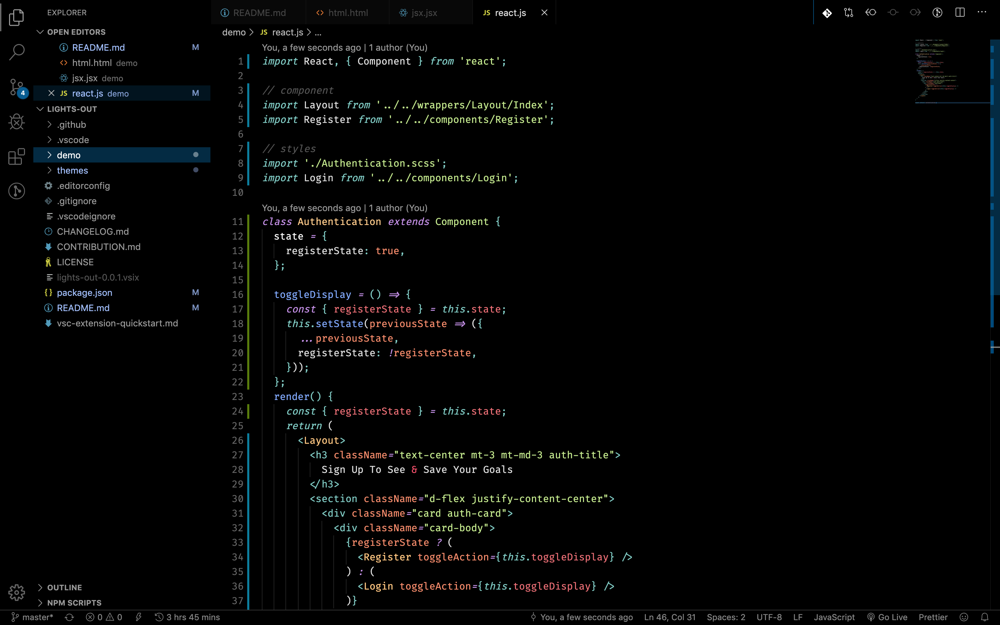

# **Lights Out Theme - VScode**

A Visual Studio Code Dark theme inspired by [Twitter's](https://twitter.com) light's out mode.

# Installation

1. Open **Extensions** sidebar panel in VS Code. `View → Extensions`
2. Search for `Lights Out` - find the one by **Nedy Udombat**
3. Click **Install** to install it.
4. Click **Reload** to reload the your editor
5. Navigate to Code > Preferences > Color Theme > **Lights Out**
6. Optional: Use the recommended settings below for best experience
7. Look at you!!! You did it, now enjoy 🎉🎉.

## **Contribution and Issues**

If you find an issue please do well to report it [here](https://github.com/NedyUdombat/lights-out-vscode-theme/issues), If you feel like spraying some love here by contributing please visit the [contributing guide](https://github.com/NedyUdombat/lights-out-vscode-theme/blob/master/CONTRIBUTION.md) to get started.

## **Itchy Thoughts 💭**

**Moulded 💆:** Over the Christmas Holiday of 2019, I decided to pass time by building a VScode theme that I would love to use of-course. I had an inspiration from Twitter's Light's out mode. This also serves as a learning process for me as I have not built a VScode extension prior to this.

**Kicker 😞:**
*As this moment this theme has not been released yet, you can watch or star this repo to get updated once the initial release is out.*

## **Reference & Inspiration**

* Twitters Lights Out Mode. 😎
* Sarah Drasner's [Night Owl Theme](https://marketplace.visualstudio.com/items?itemName=sdras.night-owl&WT.mc_id=twitter-social-sdras), you can read about it [here](https://css-tricks.com/creating-a-vs-code-theme/). *(Credits for the demo folder)*
* Wes Bos's [Cobalt2 Theme](https://github.com/wesbos/cobalt2-vscode).
* Olaolu Olawuyi's [Palenight Theme](https://github.com/whizkydee/vscode-material-palenight-theme).
